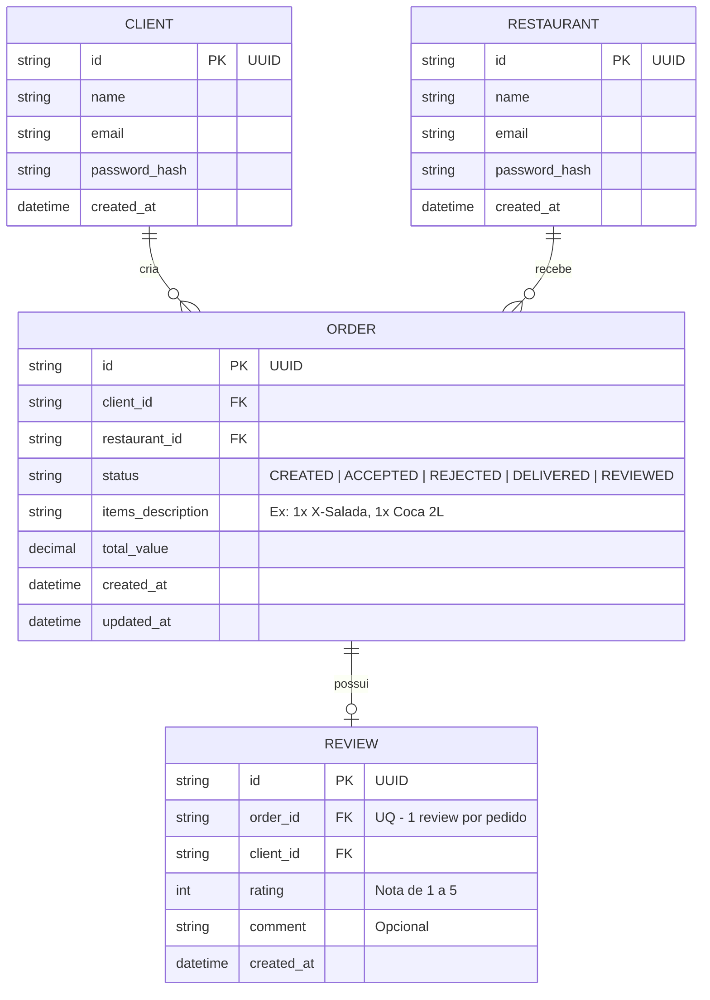
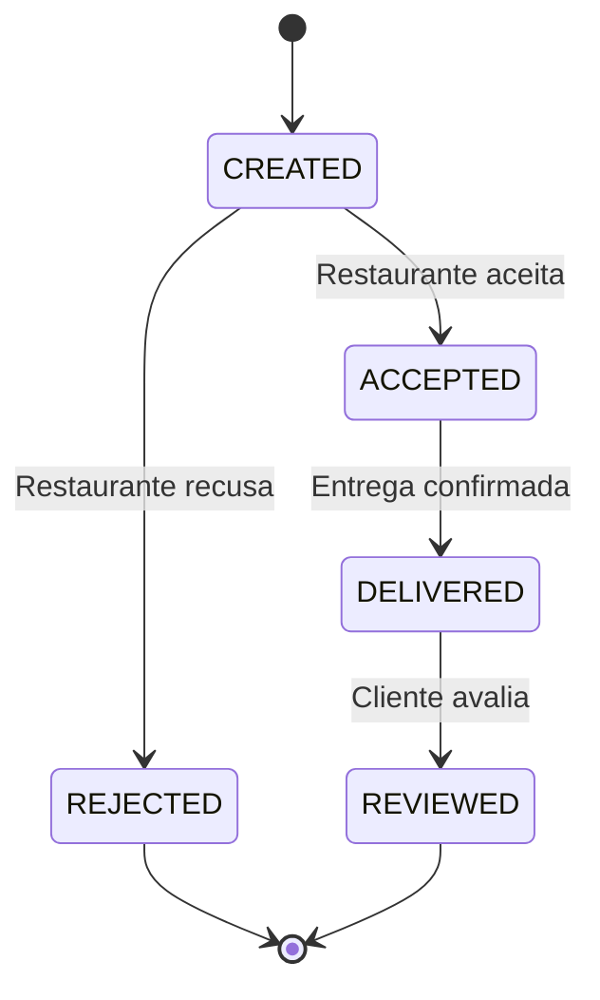

# 🗄️ Modelo de Dados e Estados

## Diagrama ER

```mermaid
erDiagram
  CLIENT ||--o{ ORDER : "cria"
  RESTAURANT ||--o{ ORDER : "recebe"
  ORDER ||--o| REVIEW : "possui"

  CLIENT {
    string id PK "UUID"
    string name
    string email
    string password_hash
    datetime created_at
  }

  RESTAURANT {
    string id PK "UUID"
    string name
    string email
    string password_hash
    datetime created_at
  }

  ORDER {
    string id PK "UUID"
    string client_id FK
    string restaurant_id FK
    string status "CREATED | ACCEPTED | REJECTED | DELIVERED | REVIEWED"
    string items_description "Ex: 1x X-Salada, 1x Coca 2L"
    decimal total_value
    datetime created_at
    datetime updated_at
  }

  REVIEW {
    string id PK "UUID"
    string order_id FK "UQ - 1 review por pedido"
    string client_id FK
    int rating "Nota de 1 a 5"
    string comment "Opcional"
    datetime created_at
  }
```

## Ciclo de Vida do Pedido

```mermaid
stateDiagram-v2
  [*] --> CREATED
  CREATED --> ACCEPTED : Restaurante aceita
  CREATED --> REJECTED : Restaurante recusa
  ACCEPTED --> DELIVERED : Entrega confirmada
  DELIVERED --> REVIEWED : Cliente avalia
  REJECTED --> [*]
  REVIEWED --> [*]
```
