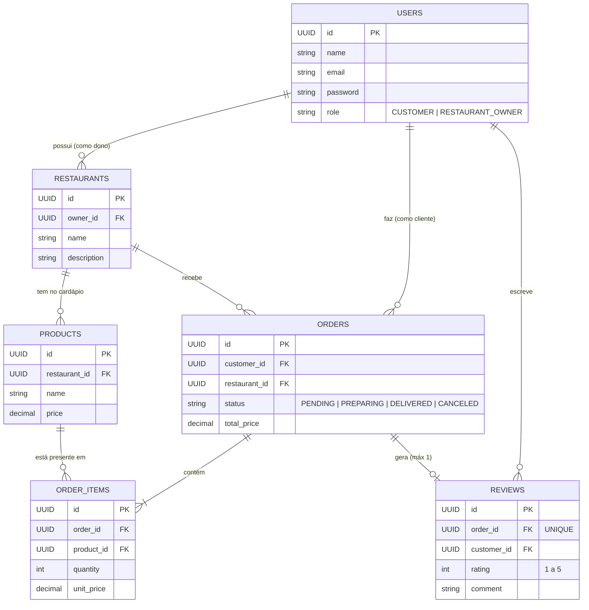

```mermaid
erDiagram
  USERS ||--o{ RESTAURANTS : "possui (como dono)"
  USERS ||--o{ ORDERS : "faz (como cliente)"
  USERS ||--o{ REVIEWS : "escreve"
  
  RESTAURANTS ||--o{ PRODUCTS : "tem no cardápio"
  RESTAURANTS ||--o{ ORDERS : "recebe"
  
  ORDERS ||--|{ ORDER_ITEMS : "contém"
  PRODUCTS ||--o{ ORDER_ITEMS : "está presente em"
  
  ORDERS ||--o| REVIEWS : "gera (máx 1)"

  USERS {
    UUID id PK
    string name
    string email
    string password
    string role "CUSTOMER | RESTAURANT_OWNER"
  }

  RESTAURANTS {
    UUID id PK
    UUID owner_id FK
    string name
    string description
  }

  PRODUCTS {
    UUID id PK
    UUID restaurant_id FK
    string name
    decimal price
  }

  ORDERS {
    UUID id PK
    UUID customer_id FK
    UUID restaurant_id FK
    string status "PENDING | PREPARING | DELIVERED | CANCELED"
    decimal total_price
  }

  ORDER_ITEMS {
    UUID id PK
    UUID order_id FK
    UUID product_id FK
    int quantity
    decimal unit_price
  }

  REVIEWS {
    UUID id PK
    UUID order_id FK "UNIQUE"
    UUID customer_id FK
    int rating "1 a 5"
    string comment
  }
```