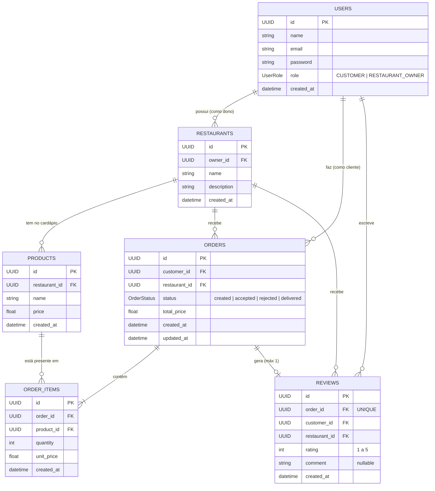

# Diagrama Entidade-Relacionamento (ERD)

```mermaid
erDiagram
  USERS ||--o{ RESTAURANTS : "possui (como dono)"
  USERS ||--o{ ORDERS : "faz (como cliente)"
  USERS ||--o{ REVIEWS : "escreve"
  
  RESTAURANTS ||--o{ PRODUCTS : "tem no cardápio"
  RESTAURANTS ||--o{ ORDERS : "recebe"
  RESTAURANTS ||--o{ REVIEWS : "recebe"
  
  ORDERS ||--|{ ORDER_ITEMS : "contém"
  PRODUCTS ||--o{ ORDER_ITEMS : "está presente em"
  
  ORDERS ||--o| REVIEWS : "gera (máx 1)"

  USERS {
    UUID id PK
    string name
    string email
    string password
    UserRole role "CUSTOMER | RESTAURANT_OWNER"
    datetime created_at
  }

  RESTAURANTS {
    UUID id PK
    UUID owner_id FK
    string name
    string description
    datetime created_at
  }

  PRODUCTS {
    UUID id PK
    UUID restaurant_id FK
    string name
    float price
    datetime created_at
  }

  ORDERS {
    UUID id PK
    UUID customer_id FK
    UUID restaurant_id FK
    OrderStatus status "created | accepted | rejected | delivered"
    float total_price
    datetime created_at
    datetime updated_at
  }

  ORDER_ITEMS {
    UUID id PK
    UUID order_id FK
    UUID product_id FK
    int quantity
    float unit_price
    datetime created_at
  }

  REVIEWS {
    UUID id PK
    UUID order_id FK "UNIQUE"
    UUID customer_id FK
    UUID restaurant_id FK
    int rating "1 a 5"
    string comment "nullable"
    datetime created_at
  }
```